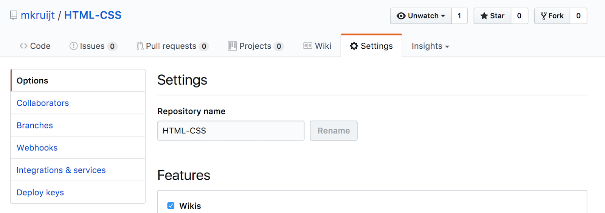
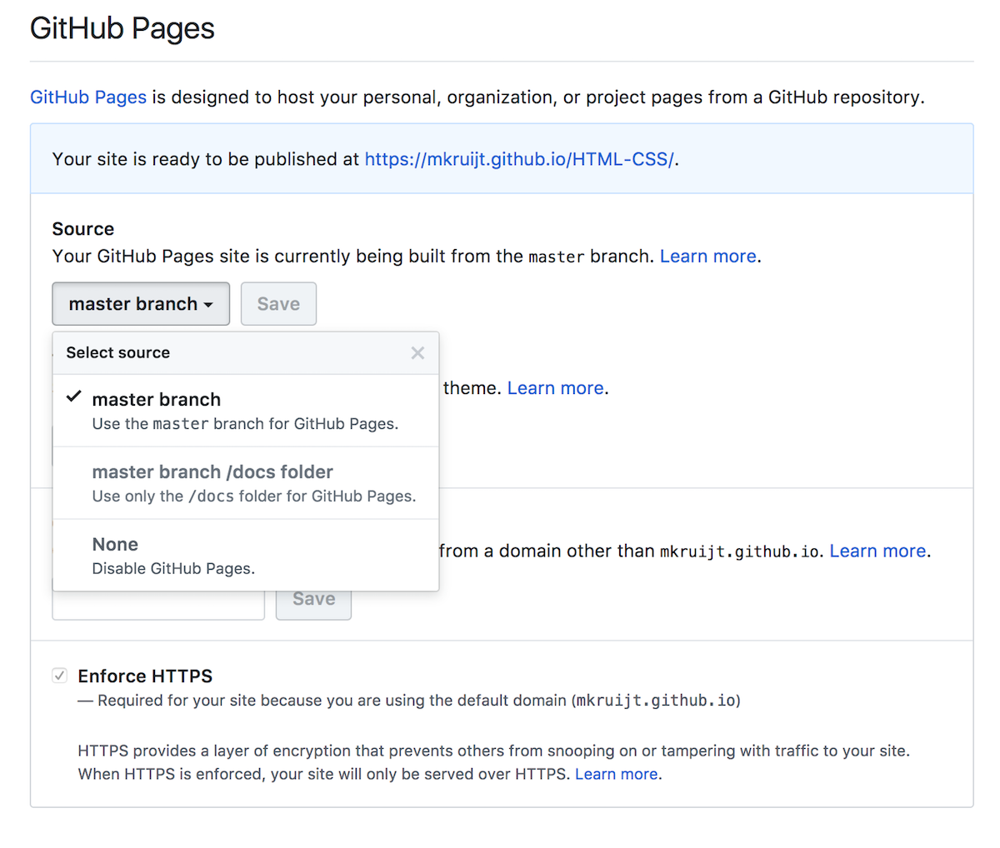

# Lesson 1

## What we will do in class today:
```
• Get set up on Slack
• Get set up on Github
• Get set up on Trello
• The division of labor between HTML and CSS
• Introduction to HTML:
    • Parents, children, attributes
    • Indentation
    • Semantic elements
    • Paragraphs, links, images, lists
• Introduction to CSS:
    • Where can we write it and what difference does that make?
    • Selectors (id, class, element type), properties
• Get your CV website hosted on Github pages!
```


### Tools
- Slack, Slack is our main communication channel
- Github, we use Github to share all of the work we do :octocat:
- Trello, here we list the homework assignments

### Install the Slack Apps on your:
- Mobile: [App store](https://itunes.apple.com/nl/app/slack/id803453959?mt=12) or [Google Play](https://play.google.com/store/apps/details?id=com.Slack&hl=nl)
- Desktop: [OSX](https://slack.com/downloads/osx) or [Windows](https://slack.com/downloads/windows)

### Read about Slack and Trello:
- About Slack: [Cheat sheet for basics and shortcuts](https://get.slack.help/hc/en-us/articles/217626358-Cheat-sheet-for-basics-and-shortcuts)
- How to format your messages in Slack: [Using Slack](https://get.slack.help/hc/en-us/articles/202288908-Format-your-messages)
- Take the Trello [tour](https://trello.com/tour)

### We have installed a text editor
- [Atom](https://atom.io/)

### HackYourFuture
Everything we teach you to do with Website Development will be on here:
[HackYourFuture curriculum](https://github.com/HackYourFuture/curriculum)


### Let’s make our first website
1. Make a folder on your desktop 
2. Make a file inside it called index.html
3. Make a file inside it called style.css

### Things to remember

All tags that open need to finish with with a closing tag
```html
<p> . . . </p> <!--the </p> is the closing tag-->
```

Everything should go inside the body tag
```html
<body> IN HERE </body>
```

## Make your own web resume:

### Step 1
- Include the following:
    - Your personal info (name, place of birth, etc.)
    - A picture
    - A few lines about who you are
    - Education
    - Work experience

### Step 2
- Include the following:
    - Different types of headings `<h1>`, `<h2>`, `<h3>` etc.
    - ``
    - `<p>`
    - Make sure that you page looks nice, and that your text is readable
    - Change the color of the text

### How to hand in your Homework :octocat: :
_Steps_:
1. In your newly created Github account search for the invitation from the Social Hackers Academy organization to you join your classes team.
2. Create a new repository (name it something like sha-html-css) make sure you select the option: initialize with README.
3. Inside your new repository create a folder called "lesson1". If you have trouble finding out how to create a folder in Github check this [Stack Overflow question](https://stackoverflow.com/questions/18773598/creating-folders-inside-github-com-repo-without-using-git)
4. Upload your website you created on your computer (step 1 and 2 of the homework) inside this folder, write a description for this “commit” (for example: "homework lesson1").
5. Your sha-html-css/lesson1 should now contain an index.html and a style.css file (and maybe a folder containing your images)
6. Open the files in your folder to check if all of this worked.
7. Now go to the settings of your repository:
8. And go to _Github Pages_ select "master" instead of "none"
9. Now you can view your homework online at: https://_hereyouplaceyourgithubusername_/sha-html-css/lesson1/
10. Please upload a link to your homework in Trello.

### Here is an example of how your homework repository should look:
- https://github.com/mkruijt/sha-html-css
- In the README file there are links to the homework hosted by Github!
